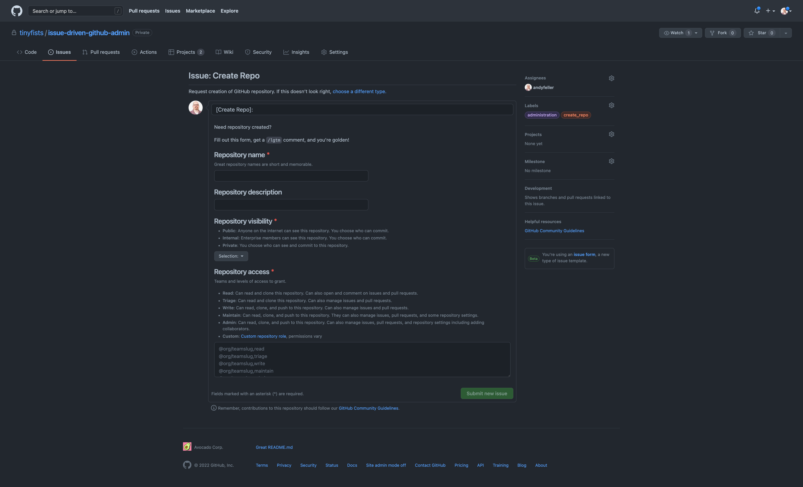
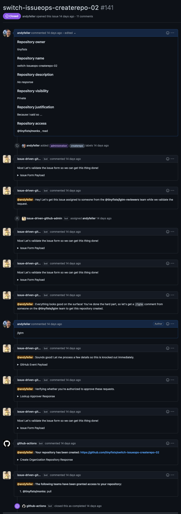

# IssueOps for creating GitHub repositories

## Motivation

Many enterprises struggle around [repository creation](https://docs.github.com/en/enterprise-cloud@latest/repositories/creating-and-managing-repositories/creating-a-new-repository), balancing best practices with developer experience:

- How visible should this be?
- Is access being only being granted to teams?
- Are branch protection rules in place?
- Is it clear who owns the repository?
- Can we satisfy regulatory requirements around controls?

For enterprises that cannot allow developers to create repositories directly, the following solution walks through a possible solution built around native GitHub functionality to provide a transparent, auditable, and minimal process to facilitate repository creation needs.

## Overview

Like many internal GitHub processes, this solution is built leveraging [issue forms](https://docs.github.com/en/enterprise-cloud@latest/communities/using-templates-to-encourage-useful-issues-and-pull-requests/syntax-for-issue-forms) and [actions](https://docs.github.com/en/enterprise-cloud@latest/actions) to facilitate requests for repository creation.



Upon filling out the issue form, a team of people can review and approve requests without having to be organization owners.



For faster response time, leverage [Slack](https://slack.github.com/) or [Microsoft Teams](https://teams.github.com/) integrations to notify responsible party when issues are created.

## Benefits

1. Self-documenting process
1. Auditable as issues and comments are preserved in 1 place
1. Capable of notifying relevant parties in a timely manner
1. Leverages GitHub App for necessary elevated permissions
1. Assign people to review and approve from a designated team, no organization owner access needed

## Prerequisites

1. [GitHub issue forms](https://docs.github.com/en/communities/using-templates-to-encourage-useful-issues-and-pull-requests/syntax-for-issue-forms) access
1. Ability to setup one of supported mechanisms for escalated privileges:
   1. Enterprise Personal Access Token (PAT)  _(require enterprise owner access)_
   1. GitHub App  _(requires organization owner access)_

## Setup

### Step 1: GitHub Action workflow setup

1. Create repository containing the following issue labels:

   - `administration`
   - `createrepo`

1. Expand provided source code zip / tar.gz and commit the GitHub Action workflows and issue forms within:

   ```
   └── .github
       ├── ISSUE_TEMPLATE
       │   └── createrepo.yml
       └── workflows
           ├── createrepo_assign.yml
           ├── createrepo_fulfill.yml
           └── createrepo_validate.yml
   ```

1. Update the list of organizations in **repository-owner** field within `.github/ISSUE_TEMPLATE/createrepo.yml`:

   ```yaml
   - type: dropdown
      id: repository-owner
      attributes:
         label: Repository owner
         description: Select an owner
         options:
         - tinyfists
         - visibilitysaurus
   ```

### Step 2: Organization teams for review and approval

1. Create and populate organization teams with individuals for various roles:

   - **`lgtm`**: individuals who can approve requests
   - **`lgtm-reviewers`**: nested team of `lgtm` of individuals who will be assigned to review and approve requests

   

### Step 3: Authentication setup

**Choose one of the following based on your situation, both of equally valuable and supported**

#### Option 1: GitHub App for organization-wide usage

1. [Create new GitHub App](https://docs.github.com/en/enterprise-cloud@latest/developers/apps/building-github-apps/creating-a-github-app) with the following:

   - **Homepage URL**:  URL of repository containing workflow and issue forms
   - **Webhooks**:  disable
   - **Repository permissions**:
     - administration (read and write)
     - issues (read and write)
   - **Organization permissions**:
     - members (read-only)

1. Generate [private key](https://docs.github.com/en/enterprise-cloud@latest/developers/apps/building-github-apps/authenticating-with-github-apps)

   _Note: we will need this and the App ID shortly in setting up GitHub Action secrets_

1. [Install newly created GitHub App](https://docs.github.com/en/enterprise-cloud@latest/developers/apps/managing-github-apps/installing-github-apps) into the organization

1. Create the following [repository secrets](https://docs.github.com/en/enterprise-cloud@latest/actions/security-guides/encrypted-secrets#creating-encrypted-secrets-for-a-repository):

   1. `APP_ID`:  using the App ID from the General > About section of the GitHub App
   1. `APP_PEM`:  using the downloaded private key from the General > Private keys section of the GitHub App


#### Option 2: Enterprise Personal Access Token (PAT) for enterprise-wide usage

1. Generate [personal access token](https://github.com/settings/tokens) under the machine user account with the following permissions:

   - **repo**
   - **read:org**

1. Create the following [repository secrets](https://docs.github.com/en/enterprise-cloud@latest/actions/security-guides/encrypted-secrets#creating-encrypted-secrets-for-a-repository):

   1. `ISSUEOPS_TOKEN`:  using personal access token of the machine user account

## Alterations and Workarounds

### Customizing approver and reviewer team names

You can choose different names by modifying the `LGTM_TEAM` value in respective workflows:

- `.github/workflows/createrepo_assign.yml`:

  ```yaml
  name: Create Repo - Assign
  on:
     issues:
        types:
        - opened
  env:
     LGTM_TEAM: lgtm-reviewers
  ```

- `.github/workflows/createrepo_fulfill.yml`:

  ```yaml
  name: Create Repo - Fulfill
  on:
     issue_comment:
        types:
        - created
  env:
     LGTM_TEAM: lgtm
  ```

- `.github/workflows/createrepo_validate.yml`:

  ```yaml
  name: Create Repo - Validate
  on:
     issues:
        types:
        - opened
        - edited
  env:
     LGTM_TEAM: lgtm
  ```

### Using issue template if issue forms are unavailable

For private repositories where [GitHub issue forms](https://docs.github.com/en/communities/using-templates-to-encourage-useful-issues-and-pull-requests/syntax-for-issue-forms) are not available yet, [GitHub issue templates](https://docs.github.com/en/communities/using-templates-to-encourage-useful-issues-and-pull-requests/manually-creating-a-single-issue-template-for-your-repository) are an alternative that can be parsed by [zentered/issue-forms-body-parser](https://github.com/zentered/issue-forms-body-parser).

```
---
name: Create Repo
description: Request creation of GitHub repository
title: "[Create Repo]: "
labels: administration, create_repo
---
### Repository name

<!-- Required.  Great repository names are short and memorable. -->

### Repository description

<!-- Optional.  Repository description -->

### Repository visibility

<!--
   Required.  Repository visibility including:

   Public
      Anyone on the internet can see this repository. You choose who can commit.

   Internal
      Enterprise members can see this repository. You choose who can commit.

   Private
      You choose who can see and commit to this repository.
-->

### Repository access

<!--
   Required.  Comma-separated list of teams and permissions to grant including:

   Read
      Can read and clone this repository. Can also open and comment on issues and pull requests.

   Triage
      Can read and clone this repository. Can also manage issues and pull requests.

   Write
      Can read, clone, and push to this repository.  Can also manage issues and pull requests.

   Maintain
      Can read, clone, and push to this repository.  They can also manage issues, pull requests, and some repository settings.

   Admin
      Can read, clone, and push to this repository.  Can also manage issues, pull requests, and repository settings including adding collaborators.

   Custom
      Name of custom repository role; permissions vary

   Examples:
      @org/teamslug,read
      @org/teamslug,triage
      @org/teamslug,write
      @org/teamslug,maintain
      @org/teamslug,admin
-->
```
